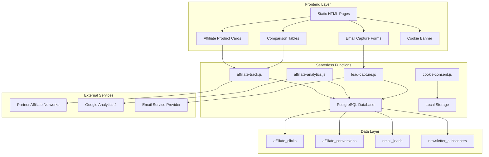

# Design Document: Affiliate Marketing Integration

## Overview

The affiliate marketing integration transforms the Private Lives Matter website into a monetization platform while maintaining its privacy-first principles. The system leverages the existing static HTML/CSS/JavaScript frontend with Netlify Functions backend to implement affiliate tracking, product comparisons, and lead generation.

The design prioritizes privacy compliance by implementing server-side tracking without third-party cookies, GDPR-compliant consent management, and transparent affiliate disclosures. The system will create five new pages optimized for conversion while maintaining the site's educational tone and Swedish language requirements.

Key architectural decisions include:
- Server-side affiliate link tracking to avoid cookie dependencies
- PostgreSQL database extension for affiliate analytics and email leads
- Static page generation with dynamic affiliate link injection
- Privacy-first analytics using first-party data only
- Modular design allowing easy addition of new affiliate products

## Architecture

The affiliate marketing system extends the existing Netlify-based architecture with new components:



The system maintains separation of concerns with distinct layers for presentation, business logic, and data persistence. All tracking occurs server-side to ensure privacy compliance and accuracy.

## Components and Interfaces

### 1. Affiliate Link Manager

**Purpose**: Manages affiliate link generation, tracking, and redirection
**Location**: `netlify/functions/affiliate-track.js`

**Interface**:
```javascript
// GET /.netlify/functions/affiliate-track?product=nordvpn&source=homepage
{
  method: 'GET',
  queryParams: {
    product: string,     // Product identifier (nordvpn, protonmail, etc.)
    source: string,      // Source page (homepage, best-vpn, etc.)
    campaign?: string    // Optional campaign identifier
  },
  response: {
    redirect: string,    // Partner affiliate URL
    status: 302
  }
}
```

**Functionality**:
- Generates unique tracking parameters for each click
- Records click events in PostgreSQL before redirect
- Handles multiple affiliate networks (Commission Junction, Impact, direct)
- Implements rate limiting to prevent abuse

### 2. Product Comparison Engine

**Purpose**: Renders dynamic product comparison tables and cards
**Location**: Static HTML with JavaScript enhancement

**Interface**:
```javascript
class ProductComparison {
  constructor(containerId, products, template);
  render(): void;
  updatePricing(): Promise<void>;
  trackInteraction(product, action): void;
}
```

**Features**:
- Static HTML base with progressive enhancement
- Real-time pricing updates via API calls
- Responsive table layouts for mobile devices
- Accessibility compliance (WCAG 2.1 AA)

### 3. Email Lead Capture System

**Purpose**: Captures email addresses with GDPR compliance
**Location**: `netlify/functions/lead-capture.js`

**Interface**:
```javascript
// POST /.netlify/functions/lead-capture
{
  method: 'POST',
  body: {
    email: string,
    consent: boolean,
    source: string,
    leadMagnet: string
  },
  response: {
    success: boolean,
    downloadUrl?: string,
    message: string
  }
}
```

**Features**:
- GDPR consent validation
- Duplicate email handling
- Automatic lead magnet delivery
- Integration with existing newsletter system

### 4. Cookie Consent Manager

**Purpose**: Manages GDPR-compliant cookie consent
**Location**: Static JavaScript with localStorage persistence

**Interface**:
```javascript
class CookieConsent {
  showBanner(): void;
  recordConsent(categories: string[]): void;
  checkConsent(category: string): boolean;
  updatePreferences(): void;
}
```

**Categories**:
- Essential: Always allowed (site functionality)
- Analytics: Google Analytics 4 (optional)
- Marketing: Affiliate tracking (optional)

### 5. Analytics Dashboard

**Purpose**: Provides affiliate performance metrics
**Location**: `netlify/functions/affiliate-analytics.js`

**Interface**:
```javascript
// GET /.netlify/functions/affiliate-analytics
{
  method: 'GET',
  headers: {
    'X-Admin-Token': string
  },
  queryParams: {
    startDate: string,
    endDate: string,
    product?: string
  },
  response: {
    clicks: number,
    conversions: number,
    revenue: number,
    topProducts: Array<ProductMetrics>
  }
}
```

## Data Models

### Database Schema Extensions

The system extends the existing PostgreSQL database with new tables:

```sql
-- Affiliate click tracking
CREATE TABLE affiliate_clicks (
  id SERIAL PRIMARY KEY,
  product_id VARCHAR(50) NOT NULL,
  source_page VARCHAR(100) NOT NULL,
  campaign VARCHAR(50),
  user_agent TEXT,
  ip_address INET,
  referrer TEXT,
  click_timestamp TIMESTAMP DEFAULT NOW(),
  session_id VARCHAR(100),
  converted BOOLEAN DEFAULT FALSE
);

-- Email lead capture
CREATE TABLE email_leads (
  id SERIAL PRIMARY KEY,
  email VARCHAR(255) UNIQUE NOT NULL,
  source_page VARCHAR(100) NOT NULL,
  lead_magnet VARCHAR(100) NOT NULL,
  consent_given BOOLEAN NOT NULL,
  created_at TIMESTAMP DEFAULT NOW(),
  converted_to_subscriber BOOLEAN DEFAULT FALSE
);

-- Affiliate product configuration
CREATE TABLE affiliate_products (
  id VARCHAR(50) PRIMARY KEY,
  name VARCHAR(100) NOT NULL,
  tier INTEGER NOT NULL CHECK (tier IN (1, 2, 3)),
  affiliate_url TEXT NOT NULL,
  commission_rate DECIMAL(5,2),
  active BOOLEAN DEFAULT TRUE,
  created_at TIMESTAMP DEFAULT NOW(),
  updated_at TIMESTAMP DEFAULT NOW()
);

-- Conversion tracking (webhook data)
CREATE TABLE affiliate_conversions (
  id SERIAL PRIMARY KEY,
  click_id INTEGER REFERENCES affiliate_clicks(id),
  product_id VARCHAR(50) REFERENCES affiliate_products(id),
  conversion_value DECIMAL(10,2),
  commission_earned DECIMAL(10,2),
  conversion_timestamp TIMESTAMP DEFAULT NOW(),
  network_transaction_id VARCHAR(100)
);
```

### Product Configuration Model

```javascript
const ProductTiers = {
  TIER_1: [
    {
      id: 'nordvpn',
      name: 'NordVPN',
      category: 'vpn',
      affiliateUrl: 'https://nordvpn.com/special/deal/?coupon=...',
      commissionRate: 35.00,
      features: ['No-logs policy', '5400+ servers', 'Kill switch'],
      pricing: { monthly: 11.95, annual: 4.99 }
    },
    {
      id: 'surfshark',
      name: 'Surfshark VPN',
      category: 'vpn',
      affiliateUrl: 'https://surfshark.deals/...',
      commissionRate: 40.00,
      features: ['Unlimited devices', 'CleanWeb', 'MultiHop'],
      pricing: { monthly: 12.95, annual: 2.49 }
    }
    // ... other Tier 1 products
  ]
};
```

### Analytics Data Model

```javascript
const AnalyticsMetrics = {
  daily: {
    date: 'YYYY-MM-DD',
    clicks: number,
    conversions: number,
    revenue: number,
    conversionRate: number
  },
  products: {
    productId: string,
    clicks: number,
    conversions: number,
    revenue: number,
    tier: number
  },
  sources: {
    sourcePage: string,
    clicks: number,
    conversions: number,
    bounceRate: number
  }
};
```

## Correctness Properties

*A property is a characteristic or behavior that should hold true across all valid executions of a system—essentially, a formal statement about what the system should do. Properties serve as the bridge between human-readable specifications and machine-verifiable correctness guarantees.*

Based on the prework analysis and property reflection, the following properties ensure the affiliate marketing system operates correctly:

### Property 1: Privacy Starter Pack Display Consistency
*For any* homepage load, the Privacy_Starter_Pack section should display exactly three product cards containing NordVPN, Proton Mail, and 1Password with all required elements (benefit bullets, CTA buttons, trust disclaimers).
**Validates: Requirements 1.2, 1.4**

### Property 2: Affiliate Link Tracking Completeness
*For any* affiliate link click across all pages and products, the system should record the click in the database with complete metadata (product_id, source_page, timestamp, session_id) and successfully redirect to the correct partner URL.
**Validates: Requirements 1.3, 2.4, 4.4, 5.4, 10.1**

### Property 3: Product Tier Organization
*For any* product display context, Tier 1 products should receive primary visibility, Tier 2 products should appear as secondary options, and Tier 3 products should be positioned as free alternatives, with correct tier classification maintained across all pages.
**Validates: Requirements 7.1, 7.2, 7.3, 7.4**

### Property 4: Comparison Table Data Completeness
*For any* product comparison page (VPN, email, password managers), all displayed products should include complete feature data (security features, pricing, policies, jurisdiction) with no missing required fields.
**Validates: Requirements 2.2, 3.2, 4.2, 4.5**

### Property 5: Primary Recommendation Consistency
*For any* product category, the system should consistently recommend the designated primary choice (NordVPN for VPNs, Proton Unlimited for email, 1Password for password managers, DeleteMe for data removal) across all relevant pages.
**Validates: Requirements 2.3, 3.3, 4.3, 5.3**

### Property 6: Email Capture GDPR Compliance
*For any* email submission attempt, the system should require explicit GDPR consent checkbox confirmation, store the email with consent status in PostgreSQL, and automatically deliver the lead magnet PDF only after valid consent.
**Validates: Requirements 6.2, 6.3, 6.5**

### Property 7: SEO Optimization Completeness
*For any* affiliate marketing page, the system should include complete SEO meta tags, structured schema markup for comparisons, and achieve Lighthouse performance scores above 85 with mobile-first responsive design.
**Validates: Requirements 8.1, 8.2, 8.3, 8.4, 8.5**

### Property 8: Legal Disclosure Presence
*For any* page containing affiliate links, the system should display clear affiliate disclosure notices, maintain accessible privacy and cookie policy pages, and include transparent commission structure explanations.
**Validates: Requirements 3.5, 9.1, 9.3, 9.4**

### Property 9: Cookie Consent Enforcement
*For any* tracking or analytics functionality, the system should respect user consent preferences, only activate tracking after explicit consent, and provide granular control over essential, analytics, and marketing cookies.
**Validates: Requirements 9.2, 10.4**

### Property 10: Analytics Data Integrity
*For any* affiliate performance measurement, the system should accurately track clicks, conversions, and revenue by product and page, calculate conversion rates for email capture, and provide comprehensive KPI reporting (affiliate clicks + email capture as primary, SEO + page speed as secondary).
**Validates: Requirements 10.2, 10.3, 10.5**

### Property 11: Content Management Flexibility
*For any* product information update, the system should allow easy modification of affiliate links, product features, pricing data, and tier classifications without requiring code changes.
**Validates: Requirements 11.4**

### Property 12: Privacy Starter Pack Integration
*For any* visit to the /privacy-starter-pack landing page, the system should display the three core privacy tools (VPN, email, password manager) integrated with email capture functionality and track social media traffic conversions separately.
**Validates: Requirements 12.2, 12.4, 12.5**

## Error Handling

The affiliate marketing system implements comprehensive error handling across all components:

### Affiliate Link Tracking Errors
- **Database Connection Failures**: Graceful degradation with local logging and retry mechanisms
- **Invalid Product IDs**: Return 404 with helpful error message, log for monitoring
- **Rate Limiting**: Implement exponential backoff for suspected abuse
- **Network Timeouts**: 5-second timeout for affiliate redirects with fallback to direct links

### Email Capture Errors
- **Invalid Email Formats**: Client-side validation with server-side verification
- **Duplicate Emails**: Handle gracefully with "already subscribed" message
- **GDPR Consent Missing**: Block submission with clear consent requirement message
- **PDF Delivery Failures**: Queue for retry with user notification of delay

### Performance and SEO Errors
- **Lighthouse Score Failures**: Automated monitoring with alerts for scores below 85
- **Mobile Responsiveness Issues**: Automated testing across device breakpoints
- **Schema Markup Validation**: Continuous validation of structured data

### Legal Compliance Errors
- **Missing Disclosures**: Automated checks for affiliate disclosure presence
- **Cookie Consent Failures**: Fallback to essential-only mode with user notification
- **Privacy Policy Updates**: Version control with automatic notification system

## Testing Strategy

The affiliate marketing system requires a dual testing approach combining unit tests for specific functionality with property-based tests for comprehensive coverage.

### Unit Testing Focus
Unit tests validate specific examples, edge cases, and integration points:

- **Affiliate Link Generation**: Test specific product/source combinations
- **Email Validation**: Test edge cases (internationalized domains, plus addressing)
- **Cookie Consent Logic**: Test consent state transitions and persistence
- **Database Integration**: Test connection handling and transaction rollbacks
- **Error Conditions**: Test network failures, invalid inputs, and rate limiting

### Property-Based Testing Configuration
Property tests verify universal properties across all inputs using **fast-check** library for JavaScript:

- **Minimum 100 iterations** per property test due to randomization
- Each property test references its design document property
- Tag format: **Feature: affiliate-marketing-integration, Property {number}: {property_text}**

**Example Property Test Structure**:
```javascript
// Feature: affiliate-marketing-integration, Property 2: Affiliate Link Tracking Completeness
fc.assert(fc.property(
  fc.record({
    productId: fc.constantFrom('nordvpn', 'protonmail', '1password'),
    sourcePage: fc.constantFrom('homepage', 'best-vpn', 'secure-email'),
    sessionId: fc.uuid()
  }),
  async (clickData) => {
    const response = await affiliateTrack(clickData);
    const dbRecord = await getClickRecord(response.clickId);
    
    // Verify tracking completeness
    expect(dbRecord.product_id).toBe(clickData.productId);
    expect(dbRecord.source_page).toBe(clickData.sourcePage);
    expect(dbRecord.session_id).toBe(clickData.sessionId);
    expect(response.redirectUrl).toContain('affiliate');
  }
));
```

### Integration Testing
- **End-to-end user flows**: Homepage → product selection → affiliate click → conversion
- **Cross-browser compatibility**: Chrome, Firefox, Safari testing
- **Mobile device testing**: iOS Safari, Android Chrome
- **Performance testing**: Load testing for affiliate tracking endpoints
- **GDPR compliance testing**: Consent flow validation across EU jurisdictions

### Monitoring and Analytics
- **Real-time error tracking**: Sentry integration for production error monitoring
- **Performance monitoring**: Core Web Vitals tracking with alerts
- **Conversion funnel analysis**: Track drop-off points in affiliate flows
- **A/B testing framework**: Test different product presentations and CTAs